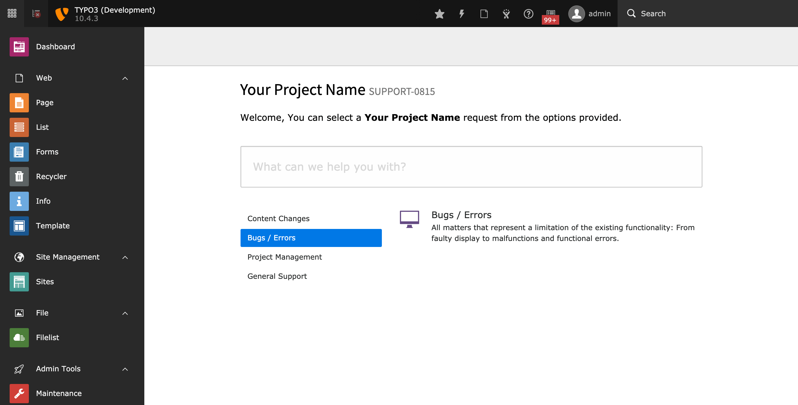

.. ==================================================
.. FOR YOUR INFORMATION
.. --------------------------------------------------
.. -*- coding: utf-8 -*- with BOM.

.. include:: ../Includes.txt

.. _introduction:

Introduction
============

This chapter gives you a basic introduction about the TYPO3 CMS extension “jira_service_desk”.

.. _what-it-does:

What does it do?
----------------

To use this extension you have to specify the URL of your Jira installation and the ID of the provided service desk in the extension configuration.

The ticket management is handled by a backend user. To use this extension, you have to enter the e-mail address and password registered in Jira in the corresponding backend user.

Dashboard
---------

The dashboard, introduced with TYPO3 version 10, supports 4 widgets:

* Information (general information of the Service Desk)
* Status (a graphical overview of open vs. closed issues)
* Type (a graphical overview of all ticket types)
* Requests (a list of recent user requests)

Screenshots
-----------

   ServiceDesk Index

.. figure:: ../Images/UserManual/Dashboard.png
   :class: with-shadow
   :alt: Dashboard
   :width: 300px

   Dashboard
