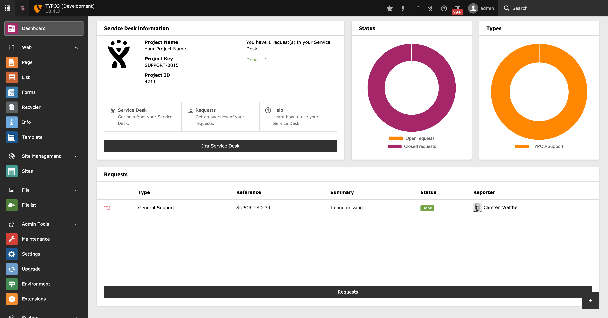
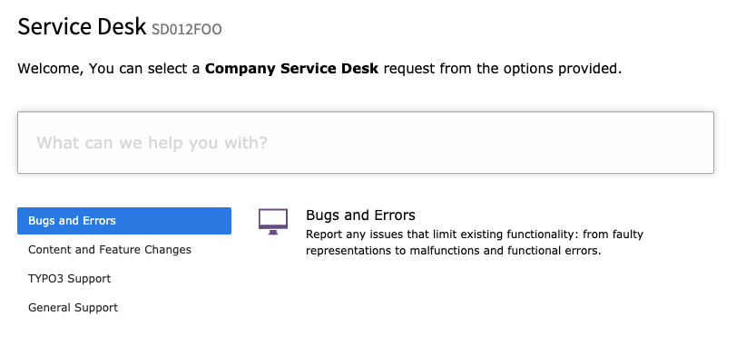
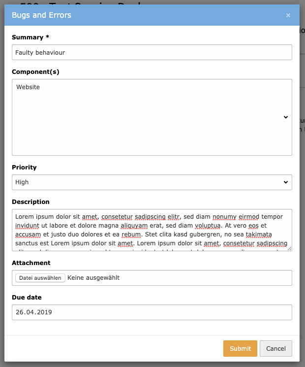
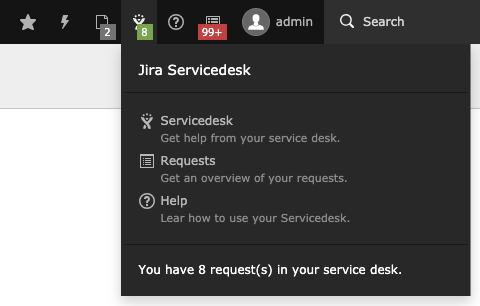
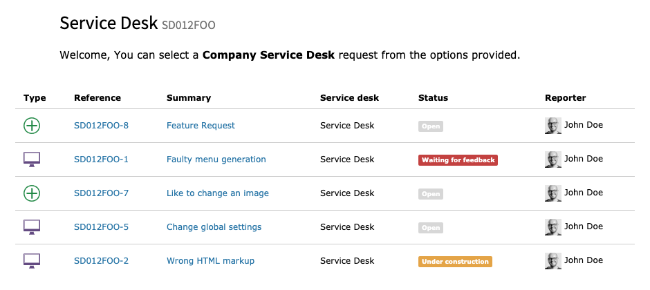
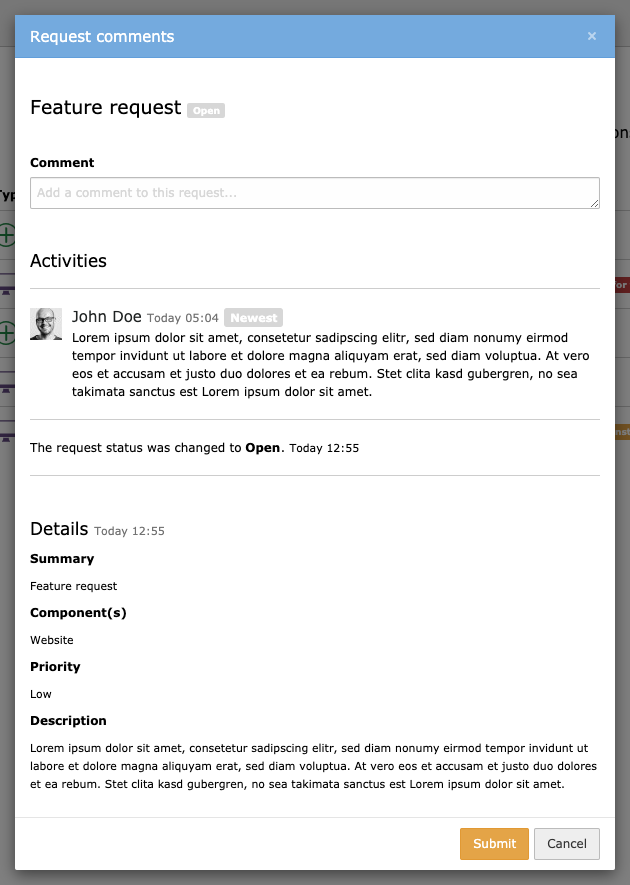

.. ==================================================
.. FOR YOUR INFORMATION
.. --------------------------------------------------
.. -*- coding: utf-8 -*- with BOM.

.. include:: ../Includes.txt

.. _user-manual:

Users Manual
============

Target group: **Editors/Users**

.. hint::

    To use the following modules and tools a configured Jira Service Desk and access to this Service Desk is required.
    Ask your administrator.

.. _dashboard:

Dashboard
---------

The dashboard, introduced with TYPO3 version 10, supports 4 widgets:

* Information (general information of the Service Desk)
* Status (a graphical overview of open vs. closed issues)
* Type (a graphical overview of all ticket types)
* Requests (a list of recent user requests)

   Dashboard

.. _service-desk-module:

Service Desk Module
-------------------

The Service Desk module is the control center of your Service Desk. Various tools and options are available to you here.

.. _reporting-tool:

Reporting Tool
~~~~~~~~~~~~~~

The reporting tool is used to create feature requests, error reports and much more. The possibilities depend on your service contract.

You can use the input search box to search for a topic or category in keywords. If you have a larger number of topics, you can limit the selection here.

If the desired category is not included, you can use the selection options under the input search field. Here you can browse through the categories to search for the desired topic.

   Reporting Tool

.. _request-form:

Request Form
~~~~~~~~~~~~

If you have made your selection using the reporting tool, you can open the corresponding form by clicking on the request type.

The display of the corresponding fields of the request form depends very much on the request type. Usually there are some mandatory fields like "Summary" or others. Mandatory fields are marked with a "*".

Fill out the request form and send it by clicking on "Send". Your service desk will immediately receive an e-mail with your inquiry. At the same time you will receive a confirmation e-mail.

   Request Form

.. _servicedesk-toolbar:

Servicedesk Toolbar
~~~~~~~~~~~~~~~~~~~

The Servicedesk Toolbar gives you a quick overview of your inquiries. You can jump directly to the enquiry form, to the overview of your enquiries or to this help.

In the lower area of the toolbar you will be informed about the number of your inquiries.

   Servicedesk Toolbar

.. _request-tool:

Request Tool
~~~~~~~~~~~~

With the help of the request tool you get a detailed overview of your requests. You will receive information about so-called ticket numbers, the status of your enquiry and much more.

   Request Tool

.. _comment-form:

Comment Form
~~~~~~~~~~~~

By clicking on a title of a request you open a detailed view of your request. This will give you an overview of the status of your request and any comments from your service desk staff or from you.

In addition, you have the possibility to leave a comment to an inquiry and thus deposit further information to the Servicedesk employees. The corresponding Servicedesk employee will be informed directly by e-mail.

   Comment Form
